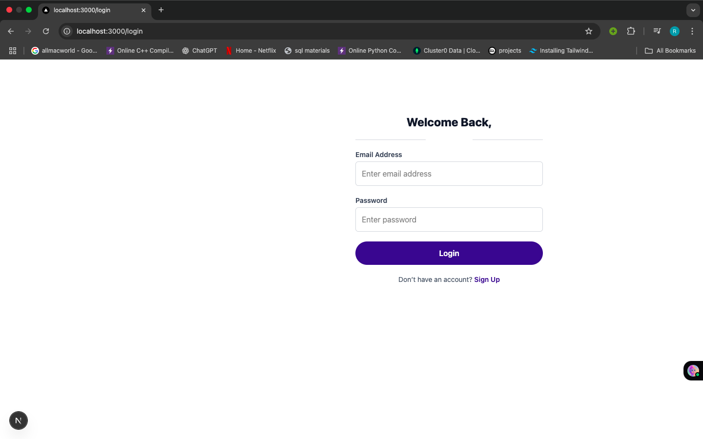

# Next.js Authentication System

This project implements a full authentication system using:

- **Custom Signup/Login**: Users can create accounts and log in with email and password.
- **Email Verification**: OTP is sent to email during signup.
- **Google OAuth**: Login using Google credentials.
- **Session Handling**: Secure sessions with JWT and custom encryption using `lib/session.ts`.
- **Protected Route**: Dashboard page only accessible to authenticated users.

## Folder Structure

```
project-root/
├── app/
│   ├── login/
│   ├── signup/
│   ├── verify-email/
│   └── dashboard/
│   └── lib/
│       └── session.ts
│
│   └── api/
│       └── auth/
│           └── [...nextauth].ts
│
│
├── middleware.ts
├── .env.local
```

---

### Signup Page


### Login Page



### Verify Email Page


---

## Protected Routes

Using `middleware.ts` to restrict access:

```ts
const protectedRoutes = ["/dashboard"];
```

If a user is not authenticated, they're redirected to `/login`.

---

## Getting Started

```bash
npm install
```

create environment variables

```bash
npm run dev
```

Visit [http://localhost:3000](http://localhost:3000)

---
